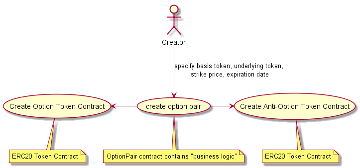
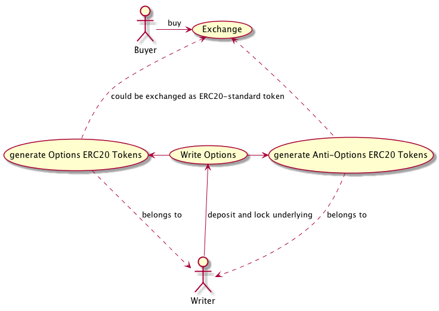
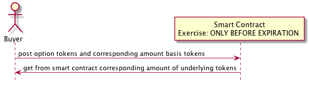
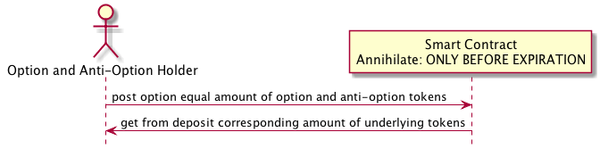

# Option contracts as ERC20-compatible tokens

## Preface
In the crypto-currency world the number of traded tokens and their trading volume increased dramatically since the last time. The volatility of the market and increased trading activity implies significant demand for the derivative instruments. There are several projects which are active in the creation of them, but there are still not many production-ready solutions. Failure to find some instrument similar to "normal" call/put options was a motivation for me (along with the desire to "dive in" into Smart Contract world) to create one.

As a result I implemented creation ERC20-compatible option contracts (which allows them, contrary to other implementations, relatively easily to be traded via numerous Ethereum based exchanges and protocols).

General information about "normal", "off-chain" option contracts one can read in Wikipedia [Option (finance)](https://en.wikipedia.org/wiki/Option_(finance) article.
Below there are some specific things about implementation, based on Ethereum smart contracts.


## Main Contracts

*Option Contract*. Gives its owner the right to get the specified amount of  underlying (ERC20) tokens in exchange for basis ERC20 tokens during the period before expiration at the specified price (strike price). The transaction, which uses this right, is called "exercise"

*Anti-Option Contract*. Gives a right to get "non-exercised" part of deposited underlying and “exercised” part of basis token after the expiration date, or, if combined with *Option Contract*, to get the corresponding token amount before the expiration date.

## Actors

1. *Option House*: owner the generating contracts, defines the fee policy.

1. *Option Pair Creator*: creates the 2 ERC20 compatible token contracts
 (option an anti-option, s. later), which specifies ERC20 token pair
 (underlying and basis), strike price  and expiration date. Additionally it creates a smart contract which check / performs "business logic". The creation of three contracts are relatively expensive in Ethereum gas terms. The idea, that the creator can take part of fees, paid later by contract usage, namely during Option Writing.

1. *Option Writer*. Deposits the  "underlying" ERC20-compatible tokens with minimum amount specified by by Option Line. in exchange she gets ERC20-compatible option contract  as well  as ERC20-compatible “anti-option” contract (s. later). For this transaction *Option Writer* pays fee.

1. *Option Buyer*. Buys *Option Contracts* e.g. on exchanges (the *Option Contracts* are fully ERC20-compatible), via 0x protocol etc.

1. *Anti-Option Buyer*. As *Option Writer* side of contracts is tokenized, one can sell / buy the *Option Writer* right to withdraw the deposit after expiration time too.

## Use Cases
1. *Creation Option Token Contracts:*
Creates 2 new ERC20 compatible *Option* and *Anti-Option* contracts


1. *Option Writing*
creates (or mint) *Option* and *Anti-Option* contracts by depositing the specified
in the contract underlying ERC20-compatible tokens
Described above:

1. *Option Exercise:*
Owner of *option contract* can *exercise option contract* **before** *expiration time*. To exercise the owner
should supply corresponding amount of basis tokens : 
1. *Withdraw:*
Owner of *anti-option* contract can withdraw corresponding amount of underlying tokens and corresponding amount of exercised basis tokens **after** *expiration time*
1. *Annihilate:*
The same amount of *option* and *anti-option* contracts can be "annihilated" **before** the *expiration time*. In this case the owner of the *annihilated* contracts gets the corresponding (as in case of *withdraw*) amount of the underlying and basis tokens


## Example

Ann creates 2 (Option and Anti-Option) ERC20-compatible contracts which specify as underlying WETH (wrapped Ethereum, to make it ERC20-compatible) and basis DAI tokens, with the strike price 3000 and expiration date 31.12.2018 (current price at the time of writing is about  900 DAI per WETH).

Bob "writes" 10 option contracts. That is he deposits 10 WETH and get (or mint) 10 Option (OPT_WETH_DAI_2018_12_31) and 10 Anti-Option contracts (A_OPT_WETH_DAI_2018_12_31).  At this point the fee could be taken. Note in the tables below the fees are not considered!

<table>
  <tr>
    <td></td>
    <td>Options</td>
    <td>Anti-Options</td>
    <td>WETH</td>
    <td>DAI</td>
  </tr>
  <tr>
    <td>Meta-Option Contract</td>
    <td></td>
    <td></td>
    <td>10</td>
    <td>0</td>
  </tr>
  <tr>
    <td>Bob</td>
    <td>10</td>
    <td>10</td>
    <td>0</td>
    <td>0</td>
  </tr>
  <tr>
    <td>Clair</td>
    <td>0</td>
    <td>0</td>
    <td>0</td>
    <td>350</td>
  </tr>
</table>


Bob sells 7  OPT_WETH_DAI_31_12_2018 contracts to Clair for 50 DAI (actually could be any asset)

<table>
<tr>
  <td></td>
  <td>Options</td>
  <td>Anti-Options</td>
  <td>WETH</td>
  <td>DAI</td>
</tr>
  <tr>
    <td>Meta-Option Contract</td>
    <td></td>
    <td></td>
    <td>10</td>
    <td>0</td>
  </tr>
  <tr>
    <td>Bob</td>
    <td>3</td>
    <td>10</td>
    <td>0</td>
    <td>350</td>
  </tr>
  <tr>
    <td>Clair</td>
    <td>7</td>
    <td>0</td>
    <td>0</td>
    <td>0</td>
  </tr>
</table>


At 01.09.2018 Bob will get back some WETH. He "annihilates" the remaining 3 OPT_1_WETH_3000_DAI_2018_12_31 with 3 anti-option contracts (A_OPT_1_WETH_3000_DAI_2018_12_31) and gets 3 from WETH back

<table>
<tr>
  <td></td>
  <td>Options</td>
  <td>Anti-Options</td>
  <td>WETH</td>
  <td>DAI</td>
</tr>
  <tr>
    <td>Meta-Option Contract</td>
    <td></td>
    <td></td>
    <td>7</td>
    <td>0</td>
  </tr>
  <tr>
    <td>Bob</td>
    <td>0</td>
    <td>7</td>
    <td>3</td>
    <td>350</td>
  </tr>
  <tr>
    <td>Clair</td>
    <td>7</td>
    <td>0</td>
    <td>0</td>
    <td>0</td>
  </tr>
</table>


The price of Ethereum went up and per 2018-11-01 the price reaches 4000 DAI per WETH. Clair decides to exercise 5 of her options. So she borrows and transfers 5 * 3000 (strike price) to meta-option contract and get back 5 WETH. These 5 WETH she sells on exchange at 4000 to make 5000 (5 * (4000 - 3000) ) DAI. Two option contracts she would like to hold for further growth.

<table>
<tr>
  <td></td>
  <td>Options</td>
  <td>Anti-Options</td>
  <td>WETH</td>
  <td>DAI</td>
</tr>
  <tr>
    <td>Meta-Option Contract</td>
    <td></td>
    <td></td>
    <td>2</td>
    <td>15000</td>
  </tr>
  <tr>
    <td>Bob</td>
    <td>0</td>
    <td>7</td>
    <td>3</td>
    <td>350</td>
  </tr>
  <tr>
    <td>Clair</td>
    <td>2</td>
    <td>0</td>
    <td>5</td>
    <td>0</td>
  </tr>
</table>


<table>
<tr>
  <td></td>
  <td>Options</td>
  <td>Anti-Options</td>
  <td>WETH</td>
  <td>DAI</td>
</tr>
  <tr>
    <td>Meta-Option Contract</td>
    <td></td>
    <td></td>
    <td>2</td>
    <td>15000</td>
  </tr>
  <tr>
    <td>Bob</td>
    <td>0</td>
    <td>7</td>
    <td>3</td>
    <td>350</td>
  </tr>
  <tr>
    <td>Clair</td>
    <td>2</td>
    <td>0</td>
    <td>0</td>
    <td>5000</td>
  </tr>
</table>


Suddenly the price drops for 2000 DAI (below strike) per WETH and remains below the strike price till expiration date. After expiration date Bob can withdraw the remaining 2 WETH (10 initial - 3 annihilated - 5 exercised) and 15000 DAI (from exercised part)


<table>
<tr>
  <td></td>
  <td>Options</td>
  <td>Anti-Options</td>
  <td>WETH</td>
  <td>DAI</td>
</tr>
  <tr>
    <td>Meta-Option Contract</td>
    <td></td>
    <td></td>
    <td>0</td>
    <td>0</td>
  </tr>
  <tr>
    <td>Bob</td>
    <td>0</td>
    <td>0</td>
    <td>5</td>
    <td>15350</td>
  </tr>
  <tr>
    <td>Clair</td>
    <td>2 (expired)</td>
    <td>0</td>
    <td>0</td>
    <td>5000</td>
  </tr>
</table>


## Others

* Put option contract

    * There is no need for them: just swap underlying and base token. In this case Ann needs to create line with underlying DAI, base WETH, e.g. 1 WETH per 500 DAI

* Differences to "normal" option contract

    * Due to tokenisation of the writer part of the contracts, the exercised and not-exercised part of the contracts are shared among all writers. E.g if Bob writes 10 options by depositing 10 WETH, Dan writes 30 options (30 WETH) and only 10 of them were executed for strike 3000 DAI, after expiration date Bob can withdraw 7.5 WETH plus 2.5 * 3000 DAI and Dan can withdraw 22.5 WETH and 7.5 * 3000 DAI

    * *Naked Options*: cannot be created


## Installation, Testing
Pre-requisite: *truffle* installation. To install run:
```
npm install -g truffle
```
To test clone repo and run tests with the help of  *truffle* run the next snippet
```
git clone https://github.com/mxn/eth_option.git
cd eth_option
npm install
truffle test
```
The example of usage of the smart contracts can be seen under *test/* directory

## Current State

As POC the smart contracts with pluggable fee taker mechanism are implemented, and partially tested (code audit is needed). I think that the option pair creator should be chosen on one hand via auction, on the other should be paid back with some governance tokens. This governance mechanism should be more thoroughly thought and can support building and expanding community. European style option could be implemented relatively easily.

The implementation was in my spare time. Generally I would be glad to find some support to proceed with the things further with more dedicated time for the development (I have a couple other ideas to monetise the solution).

If you are interesting in supporting the project, please use the contact form

<form action="https://formspree.io/sub.mxn@gmail.com" method="POST">
Your mail address and message:<p/>
<input type="email" name="_replyto" size="60" />
<p/>
<textarea name="body" rows="10" cols="60"></textarea>
<p/>
<input type="submit" value="Send" />
</form>
